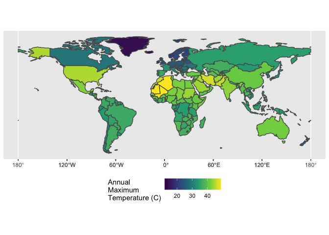

Case Study 06
================
Hui Gao
October 12, 2021

## Load Packages

``` r
library(raster)
library(sp)
library(spData)
library(tidyverse)
library(sf)
library(knitr)
```

## Load Data

``` r
data(world)  #load 'world' data from spData package
tmax_monthly <- getData(name = "worldclim", var="tmax", res=10) #load climate data
```

## Maximum Temperature of Each Country

``` r
world <- world %>%
  filter(!continent=="Antarctica")
world <- as(world, "Spatial")

gain(tmax_monthly) <- .1
tmax_annual <- max(tmax_monthly)
names(tmax_annual) <- "tmax"

tmax_annual_country <- raster::extract(tmax_annual, world, fun=max, na.rm=TRUE, small=TRUE, sp=TRUE) %>%
  st_as_sf()

ggplot() +
  geom_sf(data = tmax_annual_country, aes(fill = tmax)) +
  scale_fill_viridis_c(name="Annual\nMaximum\nTemperature (C)") +
  theme(legend.position = 'bottom')
```

<!-- -->

## Hottest Country on Each Continent

``` r
hottest_continents <- tmax_annual_country %>%
  group_by(continent) %>%
  slice_max(tmax, n = 1) %>%
  select(name_long, continent, tmax) %>%
  arrange(desc(tmax)) %>%
  st_set_geometry(NULL)
kable(hottest_continents)
```

| name\_long                          | continent               | tmax |
| :---------------------------------- | :---------------------- | ---: |
| Algeria                             | Africa                  | 48.9 |
| Iran                                | Asia                    | 46.7 |
| United States                       | North America           | 44.8 |
| Australia                           | Oceania                 | 41.8 |
| Argentina                           | South America           | 36.5 |
| Spain                               | Europe                  | 36.1 |
| French Southern and Antarctic Lands | Seven seas (open ocean) | 11.8 |
