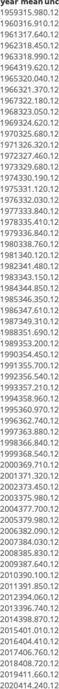

Case Study 08
================
Hui Gao
October 25, 2021

## Load libraries

``` r
library(tidyverse)
library(knitr)
library(kableExtra)
```

## Read data

``` r
data <- read_table("ftp://aftp.cmdl.noaa.gov/products/trends/co2/co2_annmean_mlo.txt", 
                   skip = 57, 
                   col_names = c("year", "mean", "unc"))
```

## Plot

``` r
ggplot(data, aes(year, mean)) +
  geom_line(color = 'red') +
  # geom_ribbon(aes(ymin=mean-unc, ymax=mean+unc), color = "grey", alpha = .1) +
  theme_bw()
```

<!-- -->

``` r
data %>% 
  kable() %>% 
  as_image(width = 10,file = "table.png")
```


