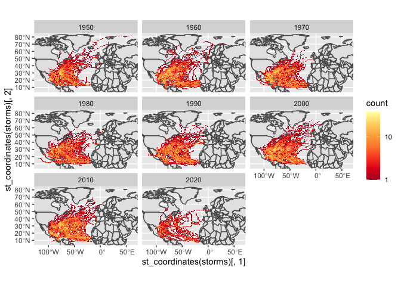

Case Study 09
================
Hui Gao
November 2, 2021

## Load libraries and data

``` r
library(sf)
library(tidyverse)
library(ggmap)
library(rnoaa)
library(spData)
library(knitr)
data(world)
data(us_states)
```

## Use the API to Download storm data

``` r
dataurl="https://www.ncei.noaa.gov/data/international-best-track-archive-for-climate-stewardship-ibtracs/v04r00/access/shapefile/IBTrACS.NA.list.v04r00.points.zip"
tdir=tempdir()
download.file(dataurl,destfile=file.path(tdir,"temp.zip"))
unzip(file.path(tdir,"temp.zip"),exdir = tdir)
list.files(tdir)
```

    ## [1] "IBTrACS.NA.list.v04r00.points.dbf" "IBTrACS.NA.list.v04r00.points.prj"
    ## [3] "IBTrACS.NA.list.v04r00.points.shp" "IBTrACS.NA.list.v04r00.points.shx"
    ## [5] "temp.zip"

``` r
storm_data <- read_sf(list.files(tdir,pattern=".shp",full.names = T))
```

## Wrangle the data

``` r
storms <- storm_data %>%
  filter(SEASON >= 1950) %>%
  mutate_if(is.numeric, function(x) ifelse(x==-999.0,NA,x)) %>%
  mutate(decade=(floor(year/10)*10))

region <- storms %>%
  st_bbox()
```

## Make the first plot

``` r
ggplot() +
  geom_sf(data = world) +
  facet_wrap(~decade) +
  stat_bin2d(data=storms, aes(y=st_coordinates(storms)[,2], x=st_coordinates(storms)[,1]),bins=100) +
  scale_fill_distiller(palette="YlOrRd", trans="log", direction=-1, breaks = c(1,10,100,1000)) +
  coord_sf(ylim=region[c(2,4)], xlim=region[c(1,3)])
```

<!-- -->

## Calculate table of the five states with most storms

``` r
us_states <- st_transform(us_states, st_crs(storms)) %>%
  rename("state" = "NAME")

storm_states <- st_join(storms, us_states, join = st_intersects,left = F)

storm_states %>%
  group_by(state) %>%
  summarise(storms = length(unique(NAME))) %>%
  arrange(desc(storms)) %>%
  slice((1:5)) %>%
  st_drop_geometry() %>%
  kable()
```

| state          | storms |
| :------------- | -----: |
| Florida        |     84 |
| North Carolina |     64 |
| Georgia        |     60 |
| Texas          |     54 |
| Louisiana      |     52 |
