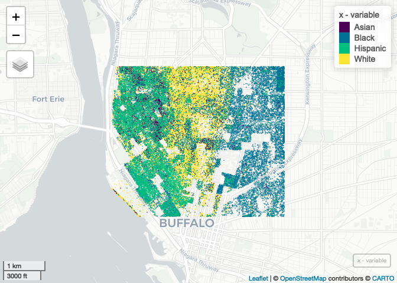

Case Study 11
================
Hui Gao
November 16, 2021

## Load packages and set Census API key

``` r
library(tidyverse)
library(spData)
library(sf)
library(mapview) # package that makes easy leaflet maps
```

    ## Warning: replacing previous import 'terra::extend' by 'raster::extend' when
    ## loading 'satellite'

    ## Warning: replacing previous import 'terra::crop' by 'raster::crop' when loading
    ## 'satellite'

    ## Warning: multiple methods tables found for 'crop'

    ## Warning: multiple methods tables found for 'extend'

``` r
library(foreach)
library(doParallel)
registerDoParallel(4)
getDoParWorkers() # check registered cores
```

    ## [1] 4

``` r
library(tidycensus)
census_api_key("d0f2cfd8dc4be91bfcdec05f805bd7dda18f3f84")
```

## Get Census data and crop the

``` r
racevars <- c(White = "P005003", 
              Black = "P005004", 
              Asian = "P005006", 
              Hispanic = "P004003")

options(tigris_use_cache = TRUE)
erie <- get_decennial(geography = "block", variables = racevars, 
                      state = "NY", county = "Erie County", geometry = TRUE,
                      summary_var = "P001001", cache_table=T) 

box = c(xmin=-78.9,xmax=-78.85,ymin=42.888,ymax=42.92)
erie_cropped = st_crop(erie, st_bbox(box))
```

    ## Warning: attribute variables are assumed to be spatially constant throughout all
    ## geometries

## Parallel sampling the Census data based on race

``` r
x <- foreach(i=unique(erie_cropped$variable),.combine='rbind') %dopar% {
  erie_cropped %>%
    filter(variable == i) %>%
    st_sample(size=.$value) %>%
    st_as_sf() %>%
    mutate(variable=i)
}
```

## Show the map

``` r
mapview(x, zcol = "variable", cex = 0.01, alpha = 0)
```

<!-- -->
